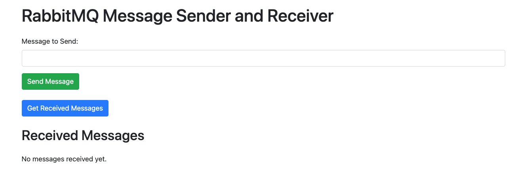

# RabbitMQ Demo Application

This is a simple Spring Boot application that demonstrates how to use RabbitMQ for messaging. The application contains a producer that sends messages to a RabbitMQ queue and a consumer that listens to and processes messages from the queue.



## Table of Contents

- [Requirements](#requirements)
- [Setup](#setup)
- [Configuration](#configuration)
- [Running the Application](#running-the-application)
- [Deploy the Application on Tanzu Platform](#deploy-the-application-on-tanzu-platform)
- [Contribute](#contribute)
- [License](#license)

## Requirements

To run this application, you will need:

- Java 21
- Maven
- Docker

## Setup

### 1. Clone the repository

```bash
git clone https://github.com/spuchol81/rabbitmq-demo.git
cd rabbitmq-demo
```

### 2. Build the project
```bash
./mvnw clean install
```

## Configuration
Everything should work out of the box, as rabbitMQ credentials have been aligned in the application configuration and the docker compose specification

application.yaml
```yaml
spring:
  application:
    name: rabbitmq-demo
  rabbitmq:
    username: guest
    password: guest
rabbitmq.exchange.name: my_exchange     # Name of the exchange
rabbitmq.queue.name: my_queue        # Name of the queue
rabbitmq.routing.key: my_routing_key   # Routing key to bind the queue to the exchange
```
compose.yaml
```yaml
services:
  rabbitmq:
    image: rabbitmq:3-management
    container_name: rabbitmq
    ports:
      - "5672:5672"  # AMQP port
      - "15672:15672" # Management UI port
    environment:
      RABBITMQ_DEFAULT_USER: guest
      RABBITMQ_DEFAULT_PASS: guest
```
## Running the application
Start the application
```bash
./mvnw spring-boot:run
```
You can access the application here: [RabbitMQ Demo App](http://localhost:8080)

## Deploy the application on Tanzu Platform
Follow [this documentation](https://docs.vmware.com/en/VMware-Tanzu-Platform/SaaS/create-manage-apps-tanzu-platform-k8s/how-to-build-and-deploy-from-source.html) to push your application to your dedicated app space.
After the deployment, the app will fail as no RabbitMQ cluster has been found
```bash
Oct 2 11:03:08.263
2024-10-02T09:03:08.263Z INFO 1 --- [rabbitmq-demo] [ main] o.s.a.r.c.CachingConnectionFactory : Attempting to connect to: [localhost:5672]
Oct 2 11:03:08.288
2024-10-02T09:03:08.288Z INFO 1 --- [rabbitmq-demo] [ main] o.s.a.r.l.SimpleMessageListenerContainer : Broker not available; cannot force queue declarations during start: java.net.ConnectException: Connection refused
Oct 2 11:03:08.301
2024-10-02T09:03:08.301Z INFO 1 --- [rabbitmq-demo] [ntContainer#0-1] o.s.a.r.c.CachingConnectionFactory : Attempting to connect to: [localhost:5672]
Oct 2 11:03:08.309
2024-10-02T09:03:08.304Z ERROR 1 --- [rabbitmq-demo] [ntContainer#0-1] o.s.a.r.l.SimpleMessageListenerContainer : Failed to check/redeclare auto-delete queue(s).
```

[Create and bind](https://docs.vmware.com/en/VMware-Tanzu-Platform/SaaS/create-manage-apps-tanzu-platform-k8s/how-to-create-services.html#create-backing-services)  a RabbitMQService to your App
Your app is automatically restarted successfully!
```bash
2024-10-01T14:23:51.943Z INFO 1 --- [rabbitmq-demo] [ main] o.s.a.r.c.CachingConnectionFactory : Attempting to connect to: [10.100.34.254:5672]
Oct 1 16:23:52.135
2024-10-01T14:23:52.135Z INFO 1 --- [rabbitmq-demo] [ main] o.s.a.r.c.CachingConnectionFactory : Created new connection: rabbitConnectionFactory#29fd8e67:0/SimpleConnection@5bb911c1 [delegate=amqp://rabbitmq@10.100.34.254:5672/, localPort=34488/]
Oct 1 16:23:52.231
2024-10-01T14:23:52.230Z INFO 1 --- [rabbitmq-demo] [ main] c.e.r.RabbitmqDemoApplication : Started RabbitmqDemoApplication in 3.043 seconds (process running for 3.538)
Oct 1 16:23:52.726
2024-10-01T14:23:52.726Z INFO 1 --- [rabbitmq-demo] [nio-8080-exec-1] o.a.c.c.C.[Tomcat].[localhost].[/] : Initializing Spring DispatcherServlet 'dispatcherServlet'
Oct 1 16:23:52.726
2024-10-01T14:23:52.726Z INFO 1 --- [rabbitmq-demo] [nio-8080-exec-1] o.s.web.servlet.DispatcherServlet : Initializing Servlet 'dispatcherServlet'
Oct 1 16:23:52.727
2024-10-01T14:23:52.727Z INFO 1 --- [rabbitmq-demo] [nio-8080-exec-1] o.s.web.servlet.DispatcherServlet : Completed initialization in 1 ms
```
## Contribute

Contributions are always welcome!

Feel free to open issues & send PR's.

## License

Copyright &copy; 2024 [Broadcom, Inc. or its affiliates](https://vmware.com).

This project is licensed under the [Apache Software License version 2.0](https://www.apache.org/licenses/LICENSE-2.0).